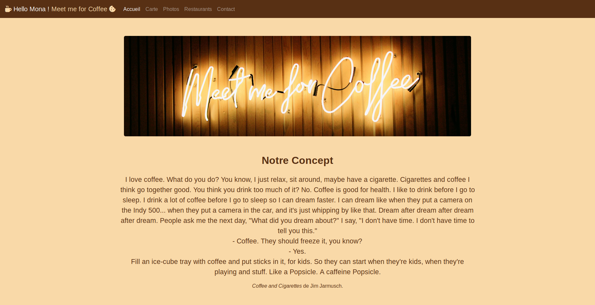

# Meet Me for Coffee

Mon premier site en bootstrap

## Description :

Un site pour une chaîne fictive de bars à cafés, en hommage à mes nombreuses heures passées chez leurs cousins réels ;-)

## Date :

Réalisé entre le 18 et le 21 février 2019 en tant que stagiaire @ [BeCode](https://github.com/becodeorg)

## Langages utilisés :

+ HTML
+ CSS
+ JAVASCRIPT

## Framework utilisé :

Bootstrap

## Progression :

Projet terminé

## Liens utiles :

+ [Consignes](https://github.com/becodeorg/BXL-Johnson-3.9/tree/master/Projets/Restaurant_Bootstrap)

+ [Github Page](https://monamarchetti.github.io/bootstrap-resto-website/)

## Aperçu du site :

## Crédits photos :

Toutes les pĥotos sont libres de droits. 
Elles proviennent du site [Unsplash](https://unsplash.com). 
Voici la liste des photographes:

+ Alexander Gilbertson

+ Don Ross III

+ Tyler Nix

+ Clem Onojeghuo

+ Hannah Wei

+ freestocks.org

+ Robert Bye

+ Jonathan Pielmayer

+ Chris Barbalis

+ Maria Vernigora

+ frank mckenna

+ Food Photographer | Jennifer Pallian

+ Mike Marquez

+ Nathan Dumlao

+ Jon Tyson

+ Eric Gilkes

+ Luke Chesser

+ Crew

+ Toa Heftiba

